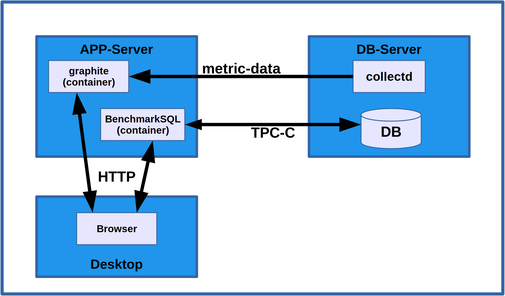
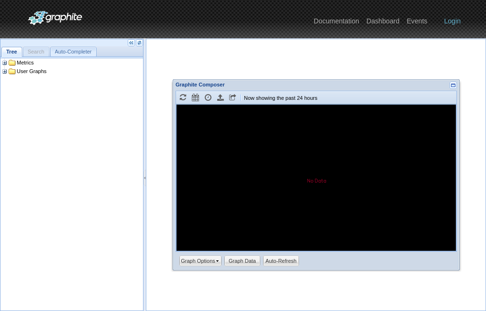
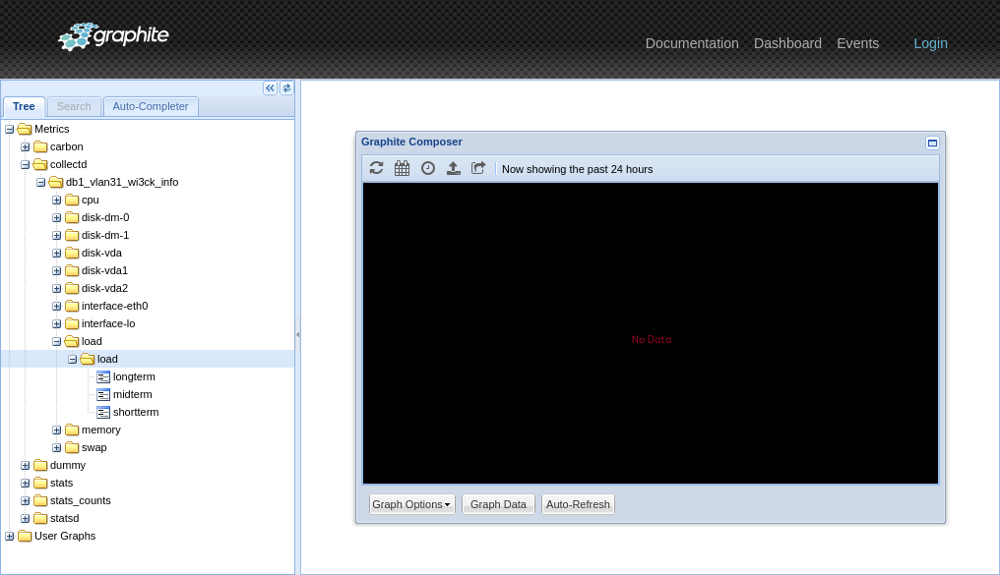
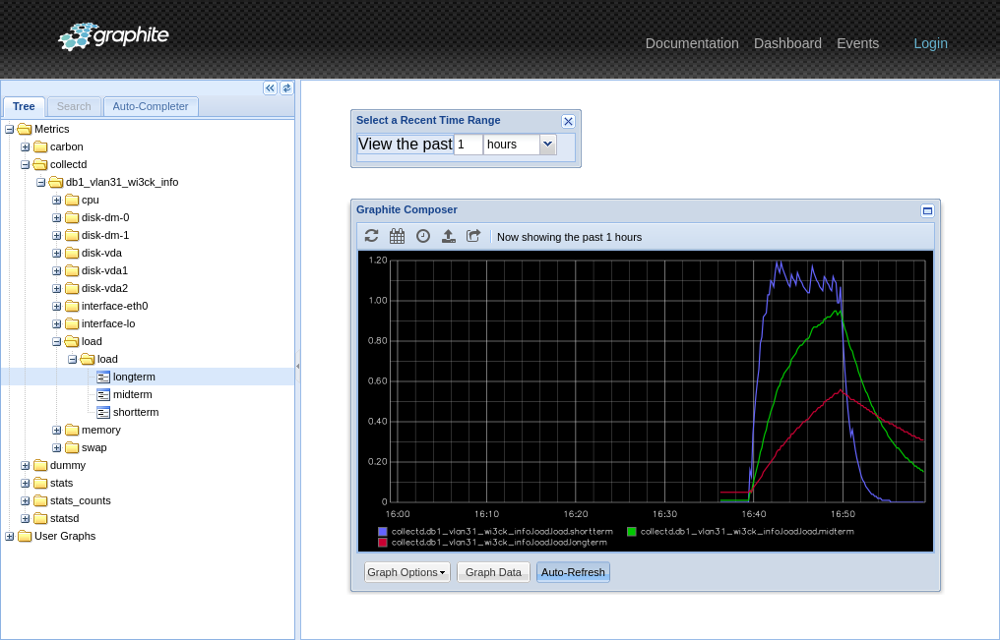
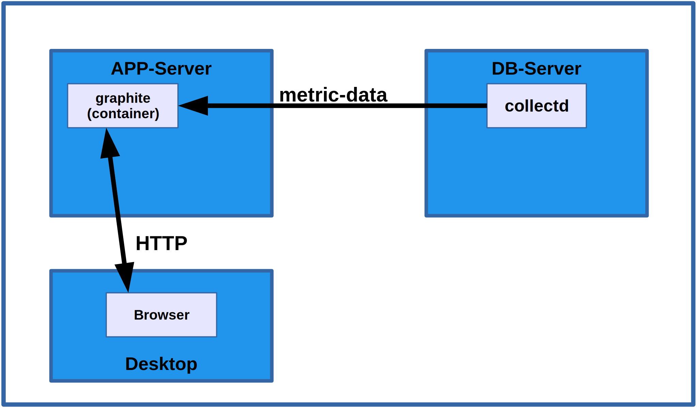

# How to collect OS metrics using *collectd* and *graphite*

## Overview

In this HOW-TO you will learn how to set up a 
*[graphite](https://graphite.readthedocs.io/en/latest/index.html)*
instance, that is suitable for our needs to collect OS
performance metrics from multiple systems and then let
*[collectd](https://collectd.org)*,
installed on the database server,
send metric data to it. For simplicity we will be using a
docker container to run *graphite*. If you happen to already have
a suitable *graphite* instance, please skip to
[Installing collectd](#installing-collectd-on-servers)
and tweak as needed.



Above is the overall network topology for this benchmark setup.
For test purposes the **APP-Server** and **DB-Server** could
very well be virtual machines on your **Desktop** system. The
two containers for *graphite* and *BenchmarkSQL* could even
run on the **Desktop** directly. It is however recommended to
at least run the **DB-Server** inside a virtual machine for
two reasons. The data gathered by *collectd* should represent
the database activity alone and installing *collectd* will
install a lot of dependencies that you may not want to keep
around on your desktop system forever.

**Important:** If you want to run the *graphite* and *BenchmarkSQL*
containers on your desktop, they need to be reachable by the
**DB-Server** system. If your desktop is behind a NAT gateway, you
will need to make several changes to the tutorial configurations
and use ssh port forwarding in order to allow the *collectd* on the
**DB-Server** to deliver the metric data to *graphite*. If you
want to actually run a benchmark, the **APP-Server** running
*BenchmarkSQL* needs to be close to the **DB-Server** anyway. You
cannot run a benchmark against a remote server from your laptop
over WiFi and/or WLan.

For the remainder of this tutorial it is assumed that the
installation will be done with two virtual machines named
**app1.vlan31** and **db1.vlan31** running in the same (virtual)
network.

## Running graphite

**TODO: the following is for CentOS systems with firewalld and docker/podman.
Need to show alternative commands for other distros.**

We aren't actually going to **install** graphite for this HOW-TO.
Instead we are opening the relevant network ports in the firewall
of the **app1.vlan31** server
and run a docker container with the *graphiteapp/graphite-statsd*
image. This image comes with a configuration that will work for
this tutorial. Namely the default metric data retention is set
to keep data at 10 second granularity for 6 hours, then at 1 minute
for 6 days and finally at 10 minutes for 1800 days. If you intend
to use *graphite* in a more serious way, check out their
[excellent graphite documentation](https://graphite.readthedocs.io/en/latest/install.html).

It is important to understand that in this setup, the *graphite*
container needs to run on a system, that can be reached by the
server(s) you want to monitor. The *collectd* installed on the
server(s) later needs to open a TCP/IP connection to port 2003
of this container.

Install *podman* (on a CentOS 8 system)
```
sudo dnf -y install podman
```
or docker (on a CentOS 7 system)
```
sudo yum -y install docker
sudo groupadd docker
sudo usermod -aG docker $USER
sudo systemctl enable docker
sudo systemctl start docker
```

Open the network ports in the firewall. We will start *graphite*
so that its HTTP GUI and API are served on port 8080 and the
metric data can be delivered on the default ports 2003 and 2004.
At the time of this writing *collectd* is not using port 2004,
which is for delivering metric data more efficiently using the
Python Pickle encoding.
```
sudo firewall-cmd --zone public --add-port 8080/tcp --permanent
sudo firewall-cmd --zone public --add-port 2003-2004/tcp --permanent
sudo firewall-cmd --reload
```

Now start *graphite*. On a system with *podman* execute
```
podman run --detach --restart=always --name graphite \
    --publish 8080:80 \
    --publish 2003-2004:2003-2004 \
    graphiteapp/graphite-statsd
```
On a system with *docker* execute this instead:
```
docker run --detach --restart=always --name graphite \
    --publish 8080:80 \
    --publish 2003-2004:2003-2004 \
    graphiteapp/graphite-statsd
```

You should now be able to point your browser at that *graphite*
instance at http://app1.vlan31:8080/ (replace the hostname with
the name or IP address of the VM where you started the graphite
docker container, or localhost if the container is running on
your desktop). You should see something like the following
screenshot, which means that *graphite* was successfully launched.



## Installing collectd on servers

### Installing packages

**TODO: Distros other than CentOS**

*Collectd* needs to be installed on each system, that we want to
gather OS performance metrics for to include them in the final
benchmark report. In this HOW-TO we only have one system that we
are interested in, which is the stand-alone **DB-Server**. But in
a more serious setup these steps need to be performed on every server
that is relevant to our benchmarking, like the hot-standby for example.

Install *collectd* on a CentOS 8 system with
```
sudo dnf -y install collectd collectd-disk
```
or on a CentOS 7 system with
```
sudo yum -y install collectd
```

### Configuring collectd

Before starting the service we need to configure it for all the
metric data we want to gather and to send all that to our *graphite*
system. Edit the file */etc/collectd.conf* and make sure that following
**LoadPlugin** statements are uncommented:
```
LoadPlugin cpu
LoadPlugin disk
LoadPlugin interface
LoadPlugin memory
LoadPlugin swap
LoadPlugin write_graphite
```

In the same file are Plugin configuration sections, which are mostly
commented out. We need the following sections active and configured as
shown:
```
# BenchmarkSQL currently cannot handle per-cpu core reporting
<Plugin cpu>
  ReportByCpy false
</Plugin>

# The following will capture IO stats for all hd*, sd*, vd* disks
# as well as the devices created by the logical volume manager.
<Plugin disk>
  Disk "/^[hsv]d[a-f][0-9]?$/"
  Disk "/^dm-/"
</Plugin>

# Send all metric data to graphite on app1.vlan31
# NOTE the dot at the end of the Prefix "collectd."
<Plugin write_graphite>
  <Node "db1.vlan31">
    Host "app1.vlan31"
	Port "2003"
	Prefix "collectd."
	Postfix ""
  </Node>
</Plugin>
```
The remaining plugins have suitable default settings.

### Configue SELINUX (if needed)

If the **DB-Server** is configured to enforce SELINUX, then collectd must
be permitted to make network connections. To do so run
```
sudo setsebool -P collectd_tcp_network_connect 1
```

### Start the collectd service

Finally start and enable *collectd* on the **DB-Server**
```
sudo systemctl start collectd
sudo systemctl enable collectd
```

### Check that *graphite* is receiving the *collectd* metric data

In the default configuration, *collectd* is only gathering and sending
metric data every 10 seconds (which is totally sufficient for our
benchmarking purposes). 

After 15-20 seconds we go back you our *graphite* browser tab at
http://app1.vlan31:8080 and **reload**. This **reload** is needed because
the *graphite* WEB UI only updates the available **Metrics** in
the left hand tree on reload.

If everything was successful and *collectd* is delivering metric data
to *graphite* there should be a **collectd** entry under **Metrics** that
can be further expanded to show the **DB-Server** and all the
individual metrics reported for it.

Expand it all down to the **load** metrics, which should look like this:



Now click once (enable) the three **load** metrics, **shortterm**,
**midterm** and **longterm**. Then change the reporting duration by
clicking on the **clock** symbol in the **Graphite Composer** to 1 hour
and enable **Auto-Refresh** at the bottom. Finally run some load
(like a pgbench) on the DB server and after a while you should see
something similar to



Congratulations, your overall setup is now half way completed
and looks like this:



In case you haven't noticed, you also now have a *graphite* system
that you can use to analyze your test database server while you
are running benchmarks or perform other tasks. Not just *BenchmarkSQL*
loads. This setup will work while running just about anything.
