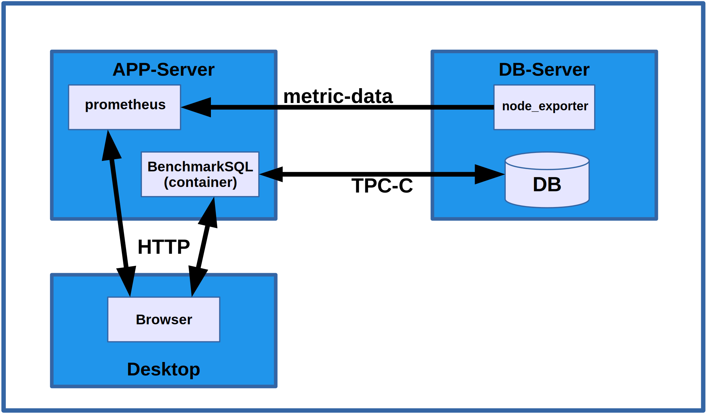
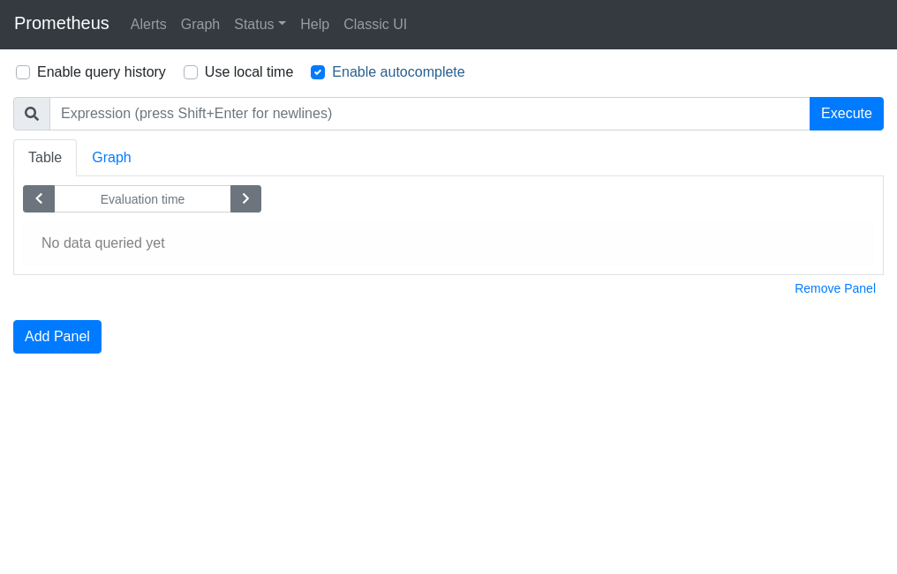
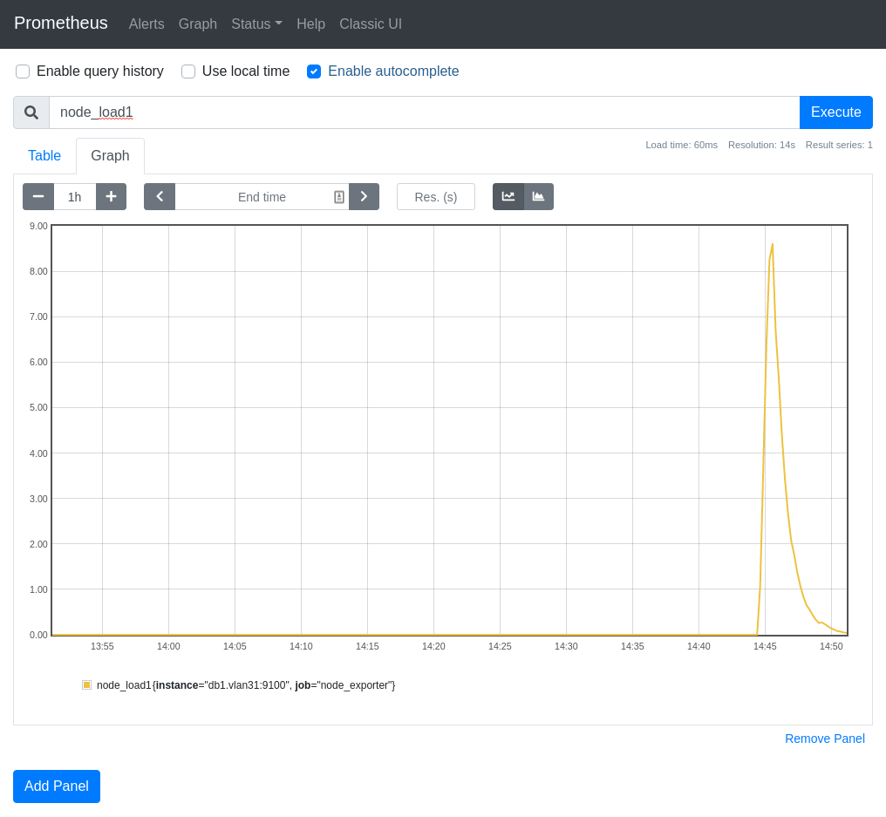
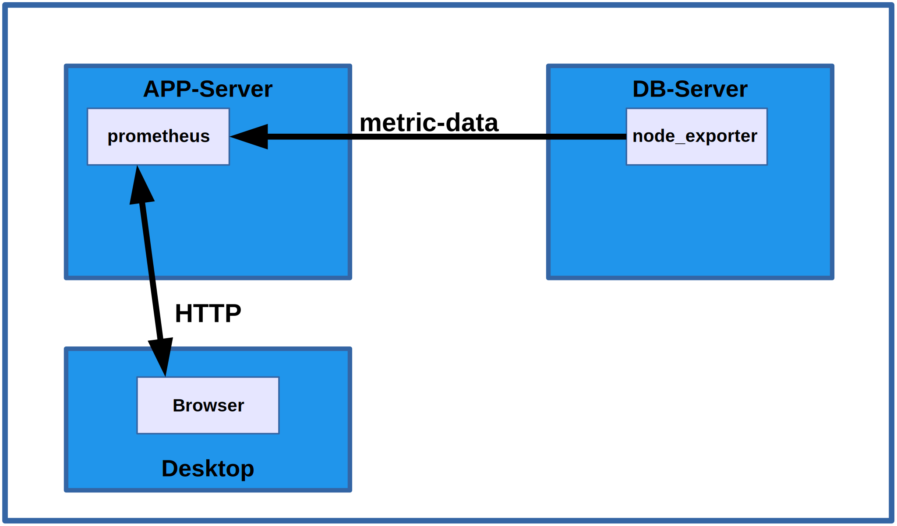
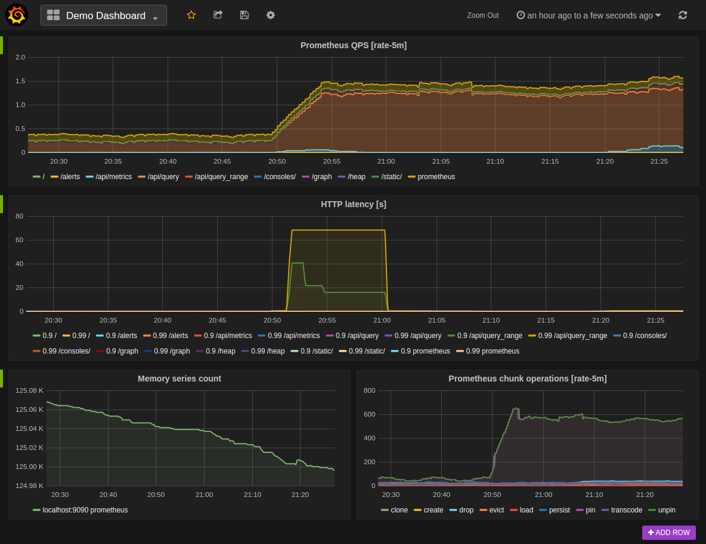

# How to collect OS metrics using *prometheus* and *node_exporter*

## Overview

In this HOW-TO you will learn how to set up a 
*[prometheus](https://prometheus.io/docs/introduction/overview/)*
instance, that is suitable for our needs to collect OS
performance metrics from multiple systems and then let it
scrape the data from
*[node_exporter](https://performance-monitoring-with-prometheus.readthedocs.io/en/latest/os.html)*,
installed on the database server,



Above is the overall network topology for this benchmark setup.
For test purposes the **APP-Server** and **DB-Server** could
very well be virtual machines on your **Desktop** system. The
container for *BenchmarkSQL* and *prometheus* could even
run on the **Desktop** directly. It is however recommended to
at least run the **DB-Server** inside a virtual machine because
the data gathered by *node_exporter* should represent
the database activity alone.

For the remainder of this tutorial it is assumed that the
installation will be done with two virtual machines named
**app1.vlan31** and **db1.vlan31** running in the same (virtual)
network.

## Installing and running prometheus

**TODO: the following is for CentOS systems with firewalld.
Need to show alternative commands for other distros.**

On the **app1.vlan31** server we
open the network port in the firewall. We will start *prometheus*
so that its HTTP GUI and API are served on port 9090 (default).
```
sudo firewall-cmd --zone public --add-port 9090/tcp --permanent
sudo firewall-cmd --reload
```
Install the *prometheus* server package on CentOS 8
```
sudo dnf install -y golang-github-prometheus
```
or on CentOS 7
```
sudo yum install -y golang-github-prometheus
```
Before starting the *prometheus* service we need to configure it to
listen on the external network interface (the installation default
on CentOS is to listen on **localhost**) and to scrape metric data
from **db1.vlan31**.

Edit the file */etc/sysconfig/prometheus* and change the
**WEB_LISTEN_ADDRESS** so that it reads:
```
WEB_LISTEN_ADDRESS=0.0.0.0:9090
```
Next edit the file */etc/prometheus/prometheus.yml* and add a job
at the end of the file (pay attention to the indentation and make sure
all tabs are expanded to spaces - the Yaml file format is very
space sensitive):
```
- job_name: 'node_exporter'

  scrape_interval: 5s

  static_configs:
    - targets: ['db1.vlan31:9100']
```
Finally we enable and start the *prometheus* service:
```
sudo systemctl enable prometheus
sudo systemctl start prometheus
```

## Installing and running node_exporter

On the **db1.vlan31** server we need to open the port that
*node_exporter* will listen on. This is the port that we configured
in *prometheus* above to scrape metric data from.
```
sudo firewall-cmd --zone public --add-port 9100/tcp --permanent
sudo firewall-cmd --reload
```
Install the *node_exporter* package on CentOS 8 with
```
sudo dnf install -y golang-github-prometheus-node-exporter
```
or on CentOS 7 with
```
sudo yum install -y golang-github-prometheus-node-exporter
```

Before we can start the *node_exporter* as a service we need to
create the required user (which should have been done by the RPM)
and configure it to listen on the external network interface
instead of **localhost**. Execute the command
```
sudo useradd -m -c "prometheus node_exporter" node_exporter
```
Then create the file /etc/sysconfig/node_exporter with the
following content:
```
OPTIONS="--web.listen-address=0.0.0.0:9100"
```
Finally we can enable and start the *node_exporter* service:
```
sudo systemctl enable node_exporter
sudo systemctl start node_exporter
```

## Testing the *prometheus* installation

You should now be able to point your browser at the *prometheus*
instance at http://app1.vlan31:9090/ (replace the hostname with
the name or IP address of the VM where you started the *prometheus*
service, or localhost if it is running on
your desktop). You should see something like the following
screenshot, which means that *prometheus* was successfully launched.



In the **Expression** field enter ```node_load1``` and
click **Execute**. Then in the tabs below (Table/Graph)
click on **Graph**. Start some load on **db1.vlan31** like
```
createdb pgbench
pgbench -i -s100 pgbench
pgbench -n -c20 -T60 pgbench
```
and wait for it to finish. The click **Execute** again and
you should see something like



Congratulations, your overall setup is now half way completed
and looks like this:



In case you haven't noticed, you also now have a *prometheus* system
that you can use to analyze your test database server while you
are running benchmarks or perform other tasks. Not just *BenchmarkSQL*
loads. This setup will work while running just about anything.

*Prometheus* by itself is not a system to build dashboards.
Instead it is possible to use a dedicated dashboard and visualization
system like
[Grafana Support for Prometheus](https://prometheus.io/docs/visualization/grafana).

